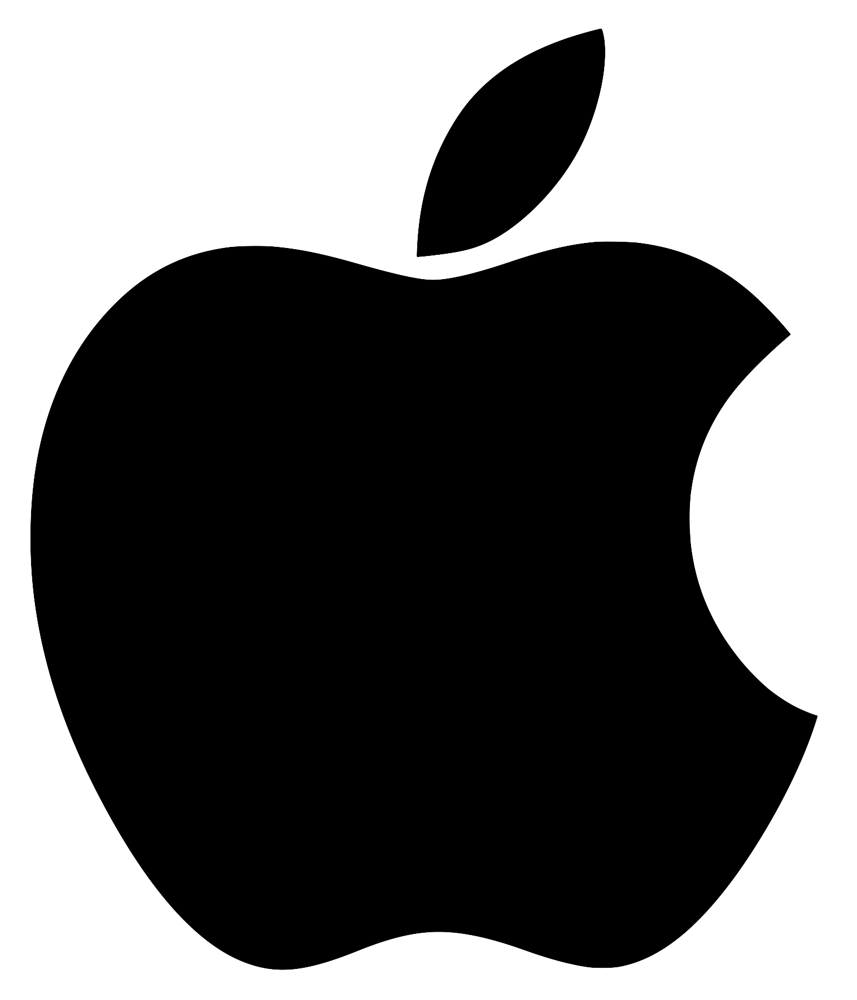

[Title: How to Make a Responsive Clicker Game in HTML CSS JS 🖱]

# Hello everyone! 

Hope you are doing well and staying safe! Welcome to a tutorial that will teach you how create your own responsive **clicker game** in `HTML CSS JS`. This tutorial will go step by step, and you'll be able to learn some basics of `HTML CSS JS` if you're new. However, prior basic knowledge is recommended :)

This will be a clicker game called **iClick**, with the theme of Apple. This is how it looks:


This is how the tutorial shall be structured:

* Gameplay

* Layout

* `HTML`
	* Click button
	* Items layout
	* Individual item

* `CSS`
	* Click button
	* Items layout
	* Individual item
	* Responsive design

* `JS`

* Final words

Let's start!

***

## Gameplay

Clicker games, also called incremental game are fun games where you have to repeatedly click or tap something on the screen. For this tutorial, as it's the theme of Apple, we'll have the big logo of Apple as the button to click. 

Players will have to keep on clicking the logo in order to get *apples*, the 'currency' of the game. There'll be a shop system where you can buy different items (Apple products, of course) that can help you get more apples. There are two categories of items; items that will give you apples per second (let's call it `aps`), and items that will give you apples per click (`apc`). 

Each item is different and will give you different amounts of apples. Their price will also double each time you purchase one.

The goal is to dominate the world by getting 7,800,000,000 apples (≈world population)!

## Layout

Since this is a clicker game, the button that you cliick should be the biggest element. We will also need to include how many apples the user has, their `aps`, and `apc`.

This is how it will look like:


We will also have the store at the bottom, where the user can buy items to increase their number of apples:


Each item will be like this:

[!individualItem]

***

# `HTML`

Some useful things before we start:

* `HTML`, which stands for Hyper Text Markup Language, is a sort of "language" for creating websites. It's not really a traditional programming language becaue it doesn't have variables, conditionals, functions, etc.

* `<!-- This is a comment -->` Comments, used for explaining your code. Anything inside it won't be executed (run)

* When I write `<!-- ... -->`, it means I'm skipping over some code (so that I don't have to keep it in there again which could be confusing).

* I'll usually show a piece of code, with comments, and then explain it in detail.

* There'll also be a few tips:

> Tip: follow along with this tutorial and make the game step by step! 

* This is how the syntax looks like:

```html
<body>
	<div id="myDiv">
		<h1 class="title">Hello World!</h1>

		<button>Click me!</button>
		
		<div id="ending">
			<p>Bye!</p>
		</div>
	</div>
</body>
```

### Click button 

Now onto the code! First, you can create a `HTML CSS JS` repl by clicking '+ New Repl' in the sidebar, then selecting `HTML CSS JS`, and then by naming it. 


You'll have this code in `index.html`:


```html
<!DOCTYPE html>
<html>
  <head>
    <meta charset="utf-8">
    <meta name="viewport" content="width=device-width">
    <title>repl.it</title>
    <link href="style.css" rel="stylesheet" type="text/css" />
  </head>

  <body>
    <script src="script.js"></script>
  </body>
</html>
```

Let's break it up. `<!DOCTYPE html>` sort of tells your browser what this document type is. Then, `<html>` is for representing the root of a `HTML` document; it contains all the other `HTML` elements. Next, in the `<head>` tag, `<meta charset="utf-8">` is for specifying the character encoding. This is so that we can use almost every character and symbol in the world. After that, there's `<meta name="viewport" content="width=device-width">` which sets the width to the device width.

`<title>repl.it</title>` is the title of the page, and `<link href="style.css" rel="stylesheet" type="text/css" />` links the `CSS`. After, there's the `<body>` tag where we link the `JS` with `<script src="script.js"></script>`.


Now let's start adding our own code. First, we'll add `initial-scale=1.0` after the `device-width`. This sets the default zoom level. Next, in the `<title>` tag, we changed it to `iClick`, the name of the game. We've also added a favicon, which is a little image on the tab.

> Tip: always try to have nice looking code; use indents, be consistent with quotes (`'` vs `"`), whitespace (empty lines, line breaks), etc. Read more [with this Medium article](https://medium.com/@sergimarquez/8-best-practices-to-write-clean-html-code-1cd407e2a7ec)

```html
<!DOCTYPE html>
<html>
  <head>
    <meta charset="utf-8">
    <meta name="viewport" content="width=device-width, initial-scale=1.0"> <!-- adding zoom level -->
    <title>iClick</title> <!-- adding new title -->
    <link href="style.css" rel="stylesheet" type="text/css"/> 
		<link rel="icon" type="image/png" sizes="32x32" href="Images/favicon.png"> <!-- adding a favicon -->
  </head>
  
	<body>
		<script src="script.js"></script>
	</body>
</html>
```

Now a few tags and notions that we will use:

`<center>` Centers everything inside
`` (Image) For creating an image
`<div>` (Division) Defines a section of the page
`<p>` (Paragraph) Defines section of text
`<span>` Defines section of inline text

You'll also see that we'll have `id`s, followed by an equal sign (`=`) and some words in quotes (`""`). `id`s are attributes, which provide additional information for tags, for linking a unique element with either the `CSS` or the `JS`, which we'll get to later. 

After those `id`s, there's equally `class`s, following the same format. `class`s are also attributes. They are similar to `id`s, but can be used multiple times. 

Here's the next bit of code, where we show the top layout with the clicker button and the apples, `aps`, and `apc`. It's also where the game over message will show up when you win.


```html
	<body>
		<script src="script.js"></script> 

		<center> <!-- centers everything -->
			 <!-- the image you have to click -->

			<div id="info"> <!-- contains the info (view below), in <span> tags -->
				<p id="appleCounter">Apples = <span id="showApples" class="number">0</span></p> <!-- shows number of apples -->

				<p>Apples per second = <span id="showApplesPerSecond" class="number">0</span></p> <!-- shows apples per second -->

				<p>Apples per click = <span id="showApplesPerClick" class="number">1</span></p> <!-- shows apples per click -->

				<p id="gameOver"></p> <!-- for text to appear when you win -->
			</div>
		</center>
	</body>
```

As you can see, we first wrap everything with `<center>`. Then, we use the `` tag to add an image. You can see the attribute `src` with contains `"Images/clickButton.png"`. This basically gets the image called `clickButton.png` in the folder `Images`:


It also has an `id`, as well as an `onclick` attribute. This will call a function, which we'll get to later in the `JS`.

> Tip: try to name your `id`s and `class`s useful names.

In the `<div>` with `id` `"info"`, we have all the useful information about the player's progress in the game. We're using `<span>` tags with `id`s and `class`s for 1) different styling with the `CSS`, and 2) for changing the numbers (as they will constantly evolve) with the `JS`.

### Items layout

Now that we're done with the top layout, we can move on to the items layout. 

Here's how we're going to layout the items. 

```html
	<body>
		<script src="script.js"></script> 

		<center>
			<!-- ... -->

			<!-- items that can be bought -->
			<div class="itemContainer"> <!-- contains 4 items per row -->
				<div class="item"> <!-- a first item -->
					
				</div>

				<div class="item"> <!-- a second item -->
					
				</div>

				<div class="item"> <!-- a third item -->
					
				</div>
				
				<div class="item"> <!-- a fourth item -->
					
				</div>
			</div>
		</center>
  </body>
```

As you can see, we first have the `<div>` with `class` `"itemContainer"` which will be a first column holding 4 rows. Each row is an item. 

Now onto an individual item layout.

### Items layout

```html
	<body>
		<script src="script.js"></script> 

		<center>
			<!-- ... -->

			<!-- items that can be bought -->
			<div class="itemContainer"> <!-- contains 4 items that you can buy -->
				<div class="item"> <!-- a first item -->
					<div class="containerImage"> <!-- contains image -->
						

						<div class="buyButtonContainer"> <!-- contains button to buy item -->
							<button>
						</div>
					</div>

					<div class="containerText"> <!-- contains stats about item -->
						<p></p>

						<p></p>

						<p></p>
					</div>
				</div>

				<!-- ... -->
				
			</div>
		</center>
  </body>
```

This is just the layout for a single item. In the `"item"` div, we have 2 main divs: one is the `"containerImage"` which contains the image of the item, and also the button to buy it, and `"containerText"` which will have several information about the item.

`<button>` defines a clickable button


```html
	<body>
		<script src="script.js"></script> 

		<center>
			<!-- ... -->

			<!-- items that can be bought -->
			<div class="itemContainer"> <!-- contains 4 items that you can buy -->
				<div class="item"> <!-- a first item -->
					<div class="containerImage"> <!-- contains image -->
						

						<div class="buyButtonContainer"> <!-- contains button to buy item -->
							<button onclick="buyIPhone()" class="buyButton">Buy</button>
						</div>
					</div>

					<div class="containerText"> <!-- contains stats about item -->
						<p>iPhones: <span id="iPhoneNum">0</span></p>

						<p>iPhone cost: <span id="iPhoneCost">10</span></p>

						<p>+1 Apples per second</p>
					</div>
				</div>

				<!-- ... -->
				
			</div>
		</center>
  </body>
```

As you can see, there's the `containerImage` div which contains an image with the `src`, `class`, and a new attribute called `style`. We can use it to specify a `width` and `height` of the image. Below, there's the `buyButtonContainer` div which holds the button to buy the item. 

In the `containerText` div, we have the `<p>` tags with, in this item, how many iPhones you have, the cost to buy an iPhone, and how many Apples per second it'll give. 

Now that's about all for the `HTML`. Yup. If you want to add more items, just use the same format as everything in the div with `class` `"item``. And when you get to 4, you'll have to make a new `<div class="itemContainer">`.

***

# `CSS`

Like the `HTML` part, some useful things to know:


* `CSS` stands for Cascading Style Sheets, and is used to style a website's page(s). This means adding colors, fonts, sizes, animations, shadows, backgrounds, etc.

* `/* This is a comment */`

* This is how the syntax looks like:

```css
p { /* styles for a tag */
	font-family: cursive;
	fonr-size: 20px;
}

#myDiv { /* styles for a id */
	background-color: red;
	border: 2px outset yellow;
	border-radius: 20px;
}

.mySecondDiv { /* styles for a class */
	width: 300px;
	height: 400px;
	margin-top: 50px;
}

.mySecondDiv:hover { /* styles for that same class but when user hovers */
	width: 100px;
	height: 150px;
}
``` 

First, we have an identifier which can be a tag (`p`, `h1`, `button`, etc.) or an `id` (starting with `#`) or a `class` (starting with `.`). Inside the curly braquets, we have the rules to apply to that identifier, for example the color, size, margins, border, etc.

You can also add pseudo-classes like `active` (when the element is being activated or clicked), `hover` (when the user uses their mouse to hover), etc.

So let's start with the actual `CSS` of the game. 

```css
body, html {
	font-family: -apple-system, BlinkMacSystemFont, 'Segoe UI', Roboto, Oxygen, Ubuntu, Cantarell, 'Open Sans', 'Helvetica Neue', sans-serif; /* font family */
	background-color: #eeeeee;
}

* {
  box-sizing: border-box; 
}
```

We first specified in the identifier tags (`body` and `html`) the main font-family of all the text. We'll also add the background-color of the page. Then, we have the `*` identifier which selects all the elements on the page. We make the `box-sizing` to `border-box` which includes the padding and border in an element's total width and height.

Now, let's style the click button.

```css
/* big apple logo to click */
#clickButton {
	width: 300px;
	height: 350px;
	margin-top: 60px;
	box-shadow: 0 4px 8px 0 #3188cc;
	border-radius: 8px;
	transition-duration: 0.3s;
	cursor: pointer; 
}
```

We applied the styles to the element with `id` `#clickButton`. Remember in our `HTML`, this is how that image looks like:

```html
 
```

So because it has `clickButton` as `id`, the styles will be applied to the image.

Back to the `CSS`, we specified a `width` and `height`. There's a `margin-top` to make it further from the top of page. We also have a `box-shadow` to make it look cool and kind of hover. The `border-radius` is to make it a bit round, the `transition-duration` is to make it change not too abruptly. Finally, `cursor: pointer;` makes the cursor change.

Now, we want some of the styles to change when you hover over the image and click on it:

```css
/* when you hover over it, box shadow color will change, and it'll rounder */
#clickButton:hover {
	box-shadow: 0 4px 8px 0 #979797;
	border-radius: 15px;
	transition-duration: 0.5s;
}

/* when you click it, box shadow color will change again, it'll be even more rounder, and will go a bit bigger */
#clickButton:active {
	box-shadow: 0 4px 8px 0 #666666;
	border-radius: 20px;
	-ms-transform: scale(1.1);
  -webkit-transform: scale(1.1); 
  transform: scale(1.1); 
}
```

As you can see, in both cases when you hover and click the image, the `box-shadow` color has changed, and the `border-radius` as well. When you hover, like from the previous step, the `transition-duration` is `0.3s`, but here it is `0.5s`. This is so that when you start to hover, it takes 0.3 seconds to change, but will take 0.5 seconds to change back when you remove your cursor.

And when you click the image, the apple's width and height shall become `1.1` times bigger. We specify it several times for compatibility. 

Now, let's we'll be styling the information below the click button.

```css
/* div with all the information (apples, apples per second, apples per click) */
#info {
	margin-top: 30px;
	margin-bottom: 50px;
	font-size: 20px;
}

#appleCounter {
	font-size: 25px;
	font-weight: bold;
}

.number {
	color: #3188cc;
}

#gameOver {
	font-size: 30px;
	color: #3188cc;
	font-style: italic;
}
```

`#info` is the div that contains al that information. We added some `margin-top` and `margin-bottom` to space it from the other elements, as well as the `font-size`. For the `#appleCounter`, we made it in bold to difference it from the others, as it's the most useful information. For all the numbers, with the `class` `.number`, we have a nice blue color with `#3188cc`.

/* contains all the items that can be bought */
.itemContainer {
  display: flex; /* using flexbox to align items */
  flex-wrap: wrap; /* to force items on multiple lines */
}

/* each individual item */
.item {
  padding: 10px; /* some spacing around */
  flex: 25%; /* to put 4 items on each line (100/4 = 25) */
}

/* each item image */
.itemImage {
	height: 20%;
	width: 20%;
}

/* contains information about each item */
.containerText {
	font-size: 16px;
  text-align: center;
}

/* contains buy button */
.buyButtonContainer {
	margin-top: 20px;
}

/* button to buy item */
.buyButton {
	cursor: pointer;
	text-align: center;
	background: #0071e3;
	color: #fff;
	font-size: 17px;
	font-family: "SF Pro Text","SF Pro Icons","Helvetica Neue","Helvetica","Arial",sans-serif;
	padding-left: 11px;
	padding-right: 11px;
	padding-top: 4px;
	padding-bottom: 4px;
	border-radius: 12px;
	border: none;
}

/* on hover, makes button a bit lighter */
.buyButton:hover {
	opacity: 0.7;
}

/* for smaller screens (eg: phones) */
@media (max-width: 800px) {
  .item {
    flex: 100%; /* makes one item on each line */
  }
}